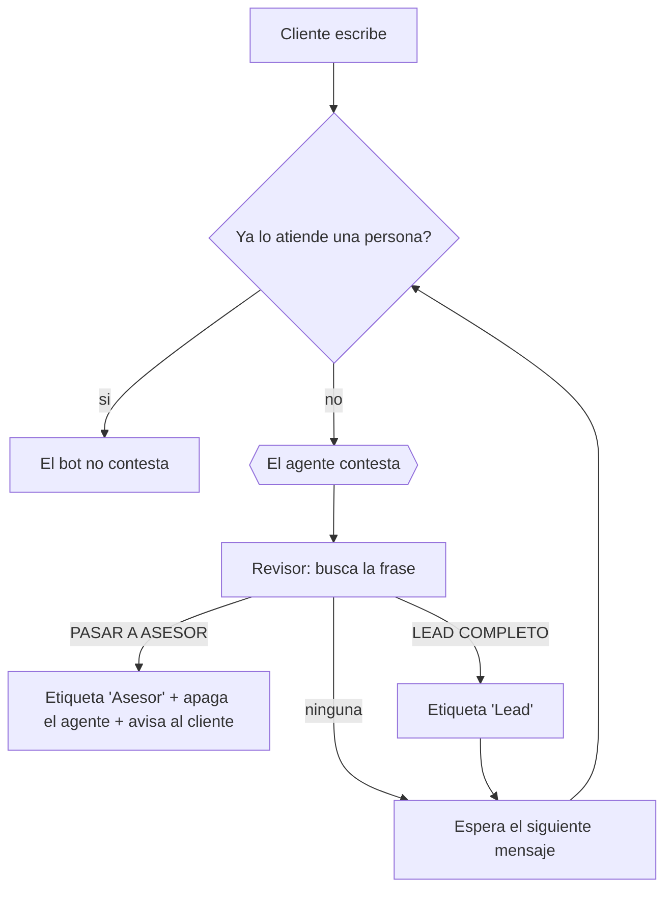

# El flujo: el camino que recorre una conversacion

## Explicaselo asi al usuario

> El agente es el que conversa. El flujo es el que **hace cosas**: te avisa, etiqueta al
> cliente, manda el catalogo, apaga el bot cuando entras tu.
>
> Funcionan juntos: el cliente escribe, el agente contesta, y el flujo revisa cada respuesta
> del agente buscando las frases especiales. Si encuentra una, ejecuta la accion. Si no,
> devuelve la conversacion al agente y sigue conversando.

---

## La forma que funciona

Es un circulo con una salida por cada accion, y una puerta a la entrada:

```
   PUNTO DE ENTRADA
          |
          v
   [ PUERTA: ya lo atiende una persona? ] --si--> [ no contestar ]
          | no
          v
   [ EL AGENTE CONTESTA ]
          |
          v
   [ REVISOR: que dijo el agente? ]
          |
    +-----+-----+-----+
    |     |     |     |
    v     v     v     v
  accion accion accion  (ninguna frase) --> [ ESPERA el siguiente mensaje ] --> vuelve a la PUERTA
    A     B     C
```

**Las cuatro partes:**

1. **La puerta.** Antes de contestar mira si la conversacion ya esta en manos de una
   persona (etiqueta `Asesor`). Si lo esta, el bot se calla. Sin esto el bot escribe
   encima del asesor.
2. **El agente.** El que conversa.
3. **El revisor.** Mira la respuesta del agente y busca las frases ancla, una por una. Cada
   frase tiene su rama con sus acciones. Si no hay ninguna, sigue al paso de espera.
4. **La espera.** Se queda esperando el siguiente mensaje del cliente y **vuelve a la
   puerta**, no directo al agente: asi, si a mitad de la conversacion alguien del equipo
   marco `Asesor`, el bot tambien se calla.

**Por que en circulo:** si el flujo terminara despues de contestar, el bot solo respondería
un mensaje y se quedaría mudo. El circulo es lo que hace que la conversacion siga.

---

## Las ramas tipicas

| Frase ancla | Que hace la rama |
|-------------|------------------|
| `PASAR A ASESOR` | Pone la etiqueta de aviso al equipo, **apaga el agente**, y manda un mensaje diciendo que ya escribe alguien |
| `LEAD COMPLETO` | Pone la etiqueta del cliente calificado (los datos —nombre, ciudad…— ya los guardo la extraccion automatica del agente, paso 8 del montaje) |
| `ENVIAR CATALOGO` | Manda la imagen o el enlace del catalogo, y el agente sigue |

⚠️ **La rama de pasar a asesor SIEMPRE apaga el agente.** Si no, el bot sigue contestando
por encima de la persona que entro a atender. Es el error que mas molesta a los equipos.

---

## Dos revisores en fila, cuando hace falta

Si una misma respuesta del agente puede disparar **dos** cosas a la vez (por ejemplo mandar
el catalogo *y* avisar al equipo), un solo revisor no sirve: elige una rama y descarta la
otra. En ese caso van dos revisores seguidos, uno detras del otro. El primero manda el
catalogo, el segundo avisa.

No lo compliques si no hace falta: la mayoria de bots de primera vez van con un revisor, y
`mibot montar` construye uno. Si el bot necesita dos, es un montaje a mano (plan B de
`08-cuando-falla.md`) o una segunda version mas adelante.

---

## Dibujarlo antes de construirlo (Fase 4)

Genera un archivo `diagrama-<negocio>.html` con el diagrama dibujado, y dile al usuario que
lo abra con doble clic. Usa Mermaid dentro del HTML — no necesita internet si incrustas la
libreria, pero si no puedes, entrega el diagrama tambien como texto en el chat.

Plantilla del diagrama (rellena las ramas con las del bot que estas armando):



**Se lo ensenas y esperas su aprobacion antes de seguir.** Preguntale con estas palabras:

> "Este es el camino que va a seguir una conversacion. Mira si falta algo que quieras que el
> bot haga, o si sobra algo. Cambiarlo ahora toma un minuto; cambiarlo despues de montarlo
> toma una hora."

Guarda la ruta del diagrama en `mi-bot.json`.

---

## Lo que se monta en la Fase 7

El flujo lo construye `mibot montar`. Tu no dibujas bloques a mano.
Lo que el comando necesita, sacado de `mi-bot.json`:

- Las frases ancla, **exactas** (el comando comprueba que estan tal cual en el prompt del
  agente, y si no, se niega a construir).
- Que acciones lleva cada rama.
- Los nombres de las etiquetas (⚠️ **maximo 15 caracteres**, es un limite duro de Botcake:
  "Cliente calificado" no cabe, "Lead" si).
- El identificador del agente, que sale de la Fase 7.

---

## Lo que escribes en `mi-bot.json` al cerrar la Fase 4

En la seccion `flujo`, una entrada por rama:

```json
"flujo": {
  "nombre": "Bot de <negocio>",
  "ramas": [
    {"frase": "PASAR A ASESOR", "etiqueta": "Asesor", "color": "#e74c3c",
     "apaga_agente": true, "mensaje": "En un momento te escribe alguien del equipo."},
    {"frase": "LEAD COMPLETO", "etiqueta": "Lead", "color": "#27ae60",
     "apaga_agente": false, "mensaje": ""}
  ]
}
```

- `frase`: **identica** a la que escribiste en el prompt. Copiala, no la vuelvas a escribir.
- `etiqueta`: maximo 15 caracteres.
- `apaga_agente`: `true` solo cuando la conversacion pasa a una persona.
- `mensaje`: lo que se le manda al cliente en esa rama. Vacio si no se manda nada.
